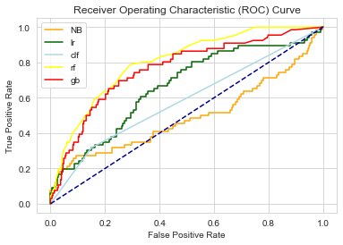
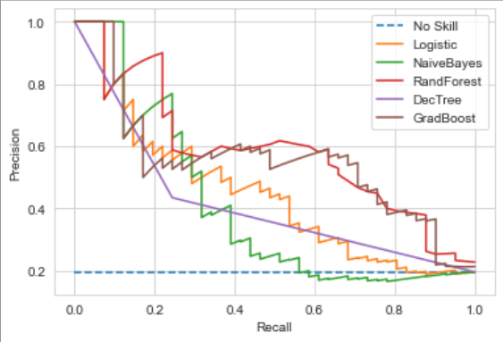
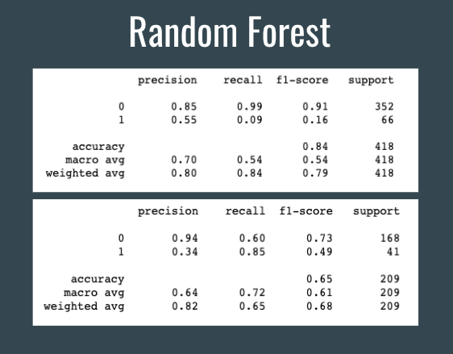
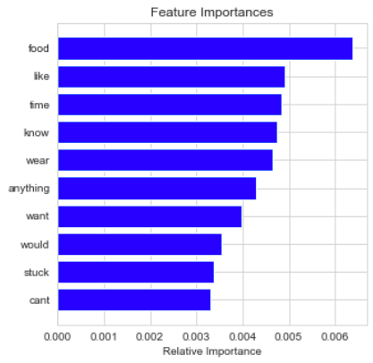

# Introduction

Postpartum, or peripartum depression is a mix of physical and mental changes that happen to many women after birth. It is classified as a major depression, and is diagnosable. Some symptoms that accompany Postpartum depression are depressed mood, mood swings, feelings of hopelessness or disconnect to your children, anxiety and panic attacks, and much more. According to the American Psychiatric Association, an estimated one in seven women experiences peripartum depression. This is a significant amount of women, and now more than ever they are coming forward and sharing the difficulties they are facing. One outlet women who have experiences with this is to post in the Reddit subreddit, “PostPartum_Depression”. Here they can share frustrations and ask for advice with any issues related to postpartum depression. As a group, we all know people who have struggled in some way with this issue, and we were interested in exploring the subreddit and see if we could find similarities between the posts. One common issue we found in many of the posts was body image complaints. We decided to explore this issue and see if we could find similarities between people who complained about body image issues. We set a goal to build a model that could accurately predict whether or not someone would post about body image issues.

# Data Cleaning

We applied for a Reddit API account, and then used that account to scrape post information from the Post_Partum subreddit. We decided to take posts from May 2021 to November 2021. We collected a created_utc column (a code for the time the user posted in the timezone the user lived in), the user who posted the content, the url to the post, the title of the post, and the selftext, which is the post itself. We had to take data a month at a time, which sometimes introduced duplicates into our data. We then took out duplicates, and all deleted or empty posts. We then converted our created_utc column into a date column that could be interpretable. 

In the end, the column that we spent the most time analyzing was the selftext variable. We decided to vectorize it, lemmatize it, and take out stop words. Since this is an unsupervised analysis, we had to self categorize data into whether or not it had to do with body image issues. After looking at many posts, we collected words that were often brought up in these posts, like “fat”, “ugly”, and “clothes”, and used them to diagnose whether a post was probably about body image issues or not. We know this isn’t a perfect categorization, which is a limitation on the analysis. We then removed these words from the dataset so that they could not be used to predict in the model.

After categorizing the data, we found that we had class imbalance, where very few posts were categorized as yes for body image. We originally only had a few months of data, so we added more data, and then chose more words to capture more posts that talked about body image. Both these things reduced the class imbalance, and we felt ready to begin evaluating the data.

# Exploratory Data Analysis

To better visualize the test that we were working with we did a number of exploratory tests including creating word clouds, polarity, and assessing readability. 

In making a word cloud for posts classified as complaining about body image issues and post classified as not complaining about body image issues, it shows what words are commonly being used. This way we know that words like feel, like, and baby are commonly used in both classifications. We can then use this knowledge to choose what words we want to include in the model. 

When we look at polarity we can see that the most positive reviews are neutral and negative. This makes sense when we consider that this subreddit is about depression. We can also see that the posts with the lowest polarity are never negative. By running these tests we can see that the posts classified as complaining about body image issues are less positive than the other ones.

Finally we looked at the readability of the posts. All of the posts have similar readability scores and are written at about a 6th to 7th grade level. 

# Methods and Research

To begin our model building, we split the data into test and training sets on an 80/20 split. We then decided to run it through Naive Bayes, logistic regression, gradient boosting, decision tree, and random forest classifying models. Given the graphic below, we decided to see how we could alter the random forest model to better predict our data. It’s area under the curve was the largest at .83 which gave us hope that we could use random forest classification to create an effective model.

However, upon further looking into the results of the  model, we saw that while it was perfectly predicting the negative cases (posts without body-image issue words), it had a sensitivity of .12. While we tried to alter the threshold to optimize our results, we realized that to gain more sensitivity, we would have to sacrifice precision. 

We began altering the threshold of the random forest model to get a better sensitivity while still maintaining a reasonable specificity. We found that a threshold of .1 gave us a sensitivity of 0.85 and a specificity of 0.6. We were much happier with this result and the model’s improved ability to recognize posts with possible body image concerns. 

There are many advantages to the random forest classifier. It has less variance than other “tree” methods due to the independence of each tree from other trees in the method and takes various steps to ensure accuracy and avoid bias.  Each tree creates its model on a random sample from the training data. This uncorrelated forest performs predictions as a crowd, like a committee of decision makers. This avoids overfitting since the trees are independent from one another and creates a more robust model. The random forest method was also preferable because in our case, we didn’t have a huge dataset, so we could take the time to run a random forest. By using a tree method, we are still able to maintain the explainability and interpretability that they have to offer, but avoid the variation found in other methods. Once we fit the model to our liking, we were able to look at the important features of the model.

 
 
This graph shows which words were most important in the decision making process. Even comparing the important features of this model to another, like Bayes, we saw vital differences in features that just made more sense to how we thought it would predict. For example, our Naive Bayes model listed “feel” as its most important feature. This felt arbitrary to us because we assumed most people on the forum were indeed talking about their feelings, regardless of the topic. While we were sure this word would occur in our positive grouping of posts, we were disappointed to see it as the most important feature. However, in our fitted random forest model, “food” was the most important feature. This aligned with our expectations and it was cool to see that our model could pick that up. 

In response to the research question, “can we accurately predict which posts will discuss body image issues?” We are pleased with our outcome. Once you start applying the scientific method outside of a controlled setting, it is easy to get upset by results seeming insignificant or research not panning out the way you thought it would. Our biggest limitations in this research were that we did not have data on the people posting that we could draw conclusions from, we had to rely on the words only. Because of this, we had to focus on the question of the content of the posts and not on the state of mind of the posters. We chose words that we thought would indicate the type of post we were trying to identify, but there are likely many manifestations of these feelings that we probably missed out on just due to our target variable definition. Another limitation we faced with text data on a forum is that there was slang and typos that the lemmatization process could not fully account for. As we ran our model, it became difficult to decide which words we should take out (beyond the stop words used initially) because we wanted to preserve the process but also get informative results. There are certainly more features we could have removed to extract more meaningful words, but we decided to trust the process where we were at and decipher why the words we ended up with would be most informative in the model’s predicting process. 

# Conclusion

In conclusion, we were able to predict post that talk about body image issues with a sensitivity of 85%. The top 10 most important words in identifying these posts were- food, like, time, know, wear, anything, want, would, stuck, and can’t. The downside to the random forest model is that we don’t know exactly how these features contributed to the identification, we just know that they were important. While other limitations to the data were previously mentioned, we were still pleased with our results. One final limitation to this project is the application of it. We could continue to build out our model to detect certain feelings or content of posts, but within the anonymous world of Reddit, it would be hard to provide real help to people.  While we feel it is important for people to have a place to talk about their various health challenges and have those feelings validated, we also feel that it is important to have resources available for people to seek professional help. We hope that the stigma surrounding postpartum depression will continue to diminish so that mothers can get the help they need and feel like they can talk about their struggles outside of anonymous forums to receive real help.  

